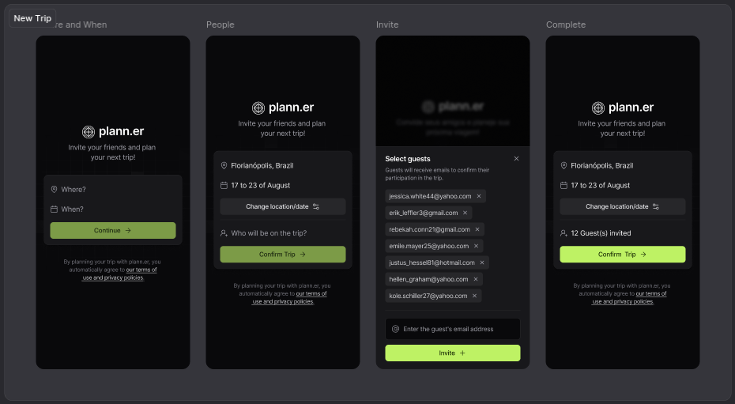

<div align="center" id="top">



</div>

<div align="center">
  <a href="#memo-project">Project</a>&nbsp;&nbsp;&nbsp;|&nbsp;&nbsp;&nbsp;
  <a href="#rocket-technologies">Technologies</a>&nbsp;&nbsp;&nbsp;|&nbsp;&nbsp;&nbsp;
  <a href="#clipboard-requirements">Requirements</a>&nbsp;&nbsp;&nbsp;|&nbsp;&nbsp;&nbsp;
  <a href="#keyboard-how-to-run-the-project">How to Run the Project</a>&nbsp;&nbsp;&nbsp;|&nbsp;&nbsp;&nbsp;
  <a href="#art-layout">Layout</a>&nbsp;&nbsp;&nbsp;|&nbsp;&nbsp;&nbsp;
</div>

<br>

---

## :memo: Project 

Travel Plann.er App
Welcome to Plann.er your Ultimate Travel Planning Companion! This mobile application helps you organize and manage travel plans with friends, record activities, and store useful links for your trips.

This project was developed during NLW Journey, held from July 9th to 12th, 2024, organized by [@Rocketseat](https://github.com/Rocketseat).

## Features

- **Travel Date and Destination Selection:** Users can input their travel destination and select travel dates using an intuitive calendar interface. The calendar includes rules to prevent choosing past dates or dates that are already booked.
- **Review and Edit Selections:** Users can review their travel choices and make edits if necessary before proceeding.
- **Friend Invitations:** Invite friends to join the trip via email. The system ensures no duplicate or invalid emails are sent. Users can see how many friends have been invited.
- **Activity Creation:** Users can create and schedule daily activities for each day of the trip, complete with timestamps. Completed activities can be marked with a check icon.
- **Important Links:** Add and manage important links related to the trip, such as accommodation details or tickets.
- **Guest Confirmation:** Guests receive an invitation with all trip details and can confirm their presence.

This project is developed using React Native and leverages various Expo libraries and tools for a seamless mobile experience.


## Server App

For information about the server app component, please refer to the [Server App README](./server/README.md).

---

## :rocket: Technologies

- [React Native](https://reactnative.dev/)
- [Expo](https://expo.dev/)
- [Axios](https://axios-http.com/docs/intro)
- [React Navigation](https://reactnavigation.org/)
- [Tailwind CSS](https://tailwindcss.com/)
- [Day.js](https://day.js.org/)
- [Zod](https://zod.dev/)
- [Expo Status Bar](https://docs.expo.dev/versions/latest/sdk/status-bar/)
- [React Native Reanimated](https://docs.swmansion.com/react-native-reanimated/)
- [React Native Calendars](https://github.com/wix/react-native-calendars)

---

## :clipboard: Requirements

Before starting, ensure you have Git, Node.js, and Expo CLI installed on your machine.

## :keyboard: How to Run the Project

```bash
# Clone this project
$ git@github.com:Ca-byte/nlw_journey.git

# Access
$ cd mobile-app
$ cd server

# Install dependencies
$ npm install

# Run the project frontend
$ npx expo start
$ npx expo start --clear

# Run the project backend
$ npm run dev

# Run the prisma studio
$ npx prisma studio

```
<br>

## 🔖 Layout ##

You can view the layout of the project through the links below:
- [NLW Journey]([[[https://www.figma.com/community/file/1356738933008624188](https://www.figma.com/design/roK4HGbD6vUPHD5DEEoPc1/NLW-Journey-%E2%80%A2-Planejador-de-viagem-(Community)?node-id=3-376&t=Do5HHUBkWyL86tqZ-0)](https://www.figma.com/design/roK4HGbD6vUPHD5DEEoPc1/NLW-Journey-%E2%80%A2-Planejador-de-viagem-(Community)?node-id=0-1&t=Do5HHUBkWyL86tqZ-0)](https://www.figma.com/design/roK4HGbD6vUPHD5DEEoPc1/NLW-Journey-%E2%80%A2-Planejador-de-viagem-(Community)?node-id=3-376&t=Do5HHUBkWyL86tqZ-0))

Remembering that you need to have a [Figma](http://figma.com/) account to access it.

---

<br>

<p align="center">Developed with 💜 by Caroline Vieira</p>
